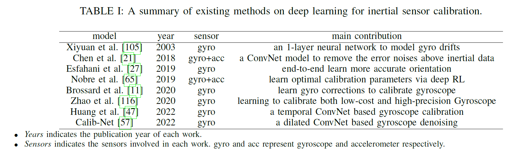
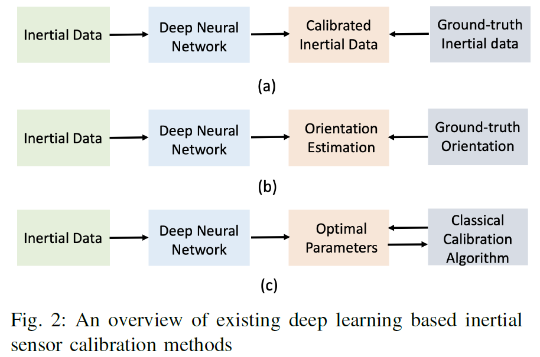
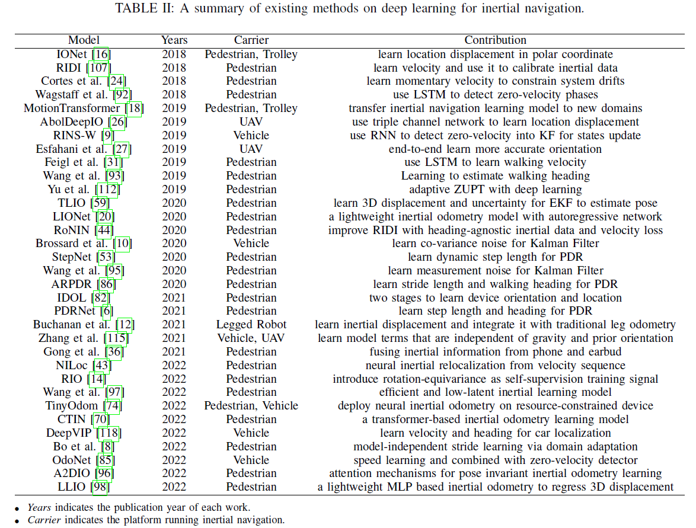
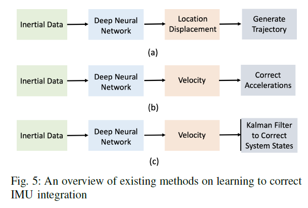
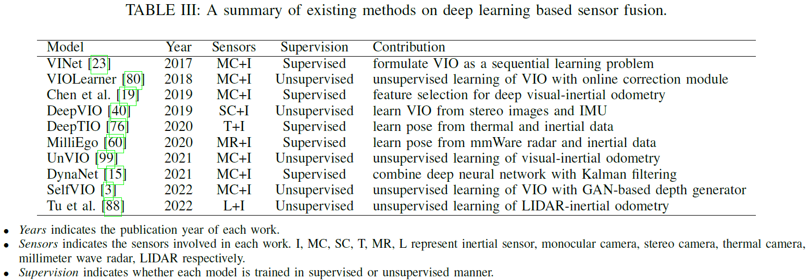
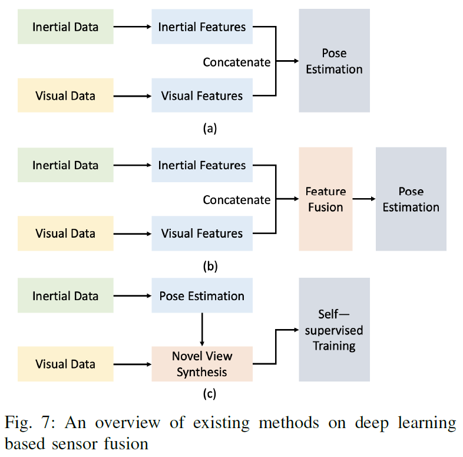

## Notes of paper：Deep Learning for Inertial Positioning: A Survey  

- paper link: https://arxiv.org/abs/2303.03757
- Acknowledgment: Thanks to the paper author (Changhao Chen)'s awesome work!

- `综述范围：`narrow the survey coverage into deep learning based inertial positioning, so that offer deeper insights and analysis over the fast-evolving developments of this area in recent five years (2018-2022).
- `涵盖研究方向：`provide a comprehensive review on deep learning based inertial positioning approaches, from **(1)measurement calibration**, **(2)inertial positioning algorithms** to **(3)sensor fusion**.

**总结**：

- **Beneifts**:
  
  - 1) Learn to approximate complex and varying function: 
    - e.g. IMU误差校准、速度/位移增量估计、步长估计、更精确的motion估计等
  - 2) Learn to estimate parameters:
    - e.g. KF噪声参数估计、零速检测估计等
  - 3) Learn to self-adapt in new domains: 
    - e.g. motion mode、carrier及sensor noise改变时依靠神经网络自监督学习能力；

- **Challenges and Opportunities**:

  - 1) Generalization and Self-learning
    - 需要解决泛化问题：transfer learning, lifelong learning, contrastive learning etc,.
    - 在有GNSS或Camera情况下，be self-supervised trained and enable mobile agents to learn from data in life-long way.
  
  - 2) Black-box and Explainability
    - 当前：lack of concrete mathematical models
    - 未来方向：(1)揭示深度学习惯导背后的物理含义；(2)introducing Bayesian deep learning.
  
  - 3) Efficiency and Real-world Deployment
    - 算力、存储空间、功耗问题，despite prediction accuracy, the consumption of computation, storage and energy should be considered in system design.
    - 模型压缩小型化，neural model compression techniques, e.g. knowledge distillation, should be introduced to discover the optimal neural structure that
balances prediction accuracy and model size.
    - 需要考虑safety and reliability
  
  - 4) Data Collection and Benchmark
    - 神经网络性能依赖数据质量，e.g. dataset size, data diversity and the
differences between training and testing set.
    - there still lacks a common benchmark to be adopted and recognized by mainstream methods in inertial positioning.
  
  - 5) Failure Cases and Physical Constraints
    - there is lack of constraint on DNN predictions. The failure cases must be considered in real usages in safety concerned applications.
    - 未来方向：possible solutions include imposing physical constraints on DNN models or combining deep learning with physical models as hybrid inertial positioning models.

  - 6) New deep learning methods
    - New model structures (e.g.transformer [91], diffusion model [75], generative model [37]),new learning methods (e.g. transfer learning, reinforcement learning, contrastive learning [87], unsupervised learning, meta
learning [33]), and the advances in other domains (e.g. neural rendering [63], voice synthesis [66])

### Survey1: measurement calibration

`Deeplearning IMU校正的三种思路, 输入均为raw IMU数据：`

- (1) 模型输出：训练后的IMU数据；
- (2) 模型输出：训练后的姿态数据；
- (3) 模型输出：训练后的最优的典型校正算法的模型参数；

`风险/问题：`
- a.模型训练学习跟传感器、车辆会相关，泛化能力可能有问题？
- b.没有深入分析消除了哪部分噪声；

---
深度学习IMU误差

#### 1. 2019-A Survey of the Research Status of Pedestrian Dead Reckoning Systems Based on Inertial Sensors

- `主要贡献：采用1层ANN网络估计陀螺漂移`proposes to use 1-layer artificial neural network (ANN) to model the distribution of gyro drifts, and successfully approximate gyro drifts with such ’shallow’ network.
- `优势：`Compared with Kalman filtering (KF) based calibration method, its advantage is that it does not require to set hyber-parameters before use, such as the sensor noise matrix in KF.
- `不足：`N/A
  
#### 2. 2018-Improving inertial sensor by reducing errors using deep learning methodology

- `主要贡献：采用CNN网络估计低精度IMU的误差`presents a CNN (ConvNet) frmework to remove the error noises above inertial measurements.
- `优势：`deep learning can remove part of sensor error and improve test accuracy.
- `不足：(1)未在真实导航场景验证；（2）训练需要高精度IMU做真值参考；`this work is not validated in a real navigation setup, and thus can not show how the learning based sensor calibration reduces error drifts of inertial navigation.

---
深度学习姿态

#### 3. 2019-Orinet: Robust 3-d orientation estimation with a single particular imu.

- `主要贡献：`OriNet inputs 3-dimensional gyroscope signals into a long-short-termmemory (LSTM) network to obtain calibrated gyroscope signals, that are integrated with the orientation at the previous timestep to generate orientation estimates at current current timestep. 
- `优势：直接估计更精准的姿态，参考真值为姿态。`A loss function between orientation estimates and
real orientation is defined and minimized for model training.
- `不足：`N/A

#### 4. 2020-Denoising imu gyroscopes with deep learning for open-loop attitude estimation

- `主要贡献：`learn gyro corrections to calibrate gyroscope
- `优势：`learns to calibrate gyroscope but using convolutional neural networks (ConvNet) instead, reporting good attitude estimation accuracy as well.
- `不足：`N/A

#### 5. 2022-Calib-net: Calibrating the low-cost imu via deep convolutional neural network.

- `主要贡献：`To extract effective spatiotemporal features from inertial data, Calib-Net is based on
dilation ConvNet to compensate the gyro noise.
- `优势：`this model is able to reduce orientation error largely, compared with raw IMU integration. When this learned inertial calibration model is incorporated into a visual-inertial odometry (VIO), it further improves localization performance, and outperforms representative VIO
- `不足：`N/A

#### 6. 2022-A mems imu gyroscope calibration method based on deep learning

#### 7. 2020-Learning to compensate for the drift and error of gyroscope in vehicle localization

---
深度学习传统IMU校准算法的模型参数

#### 8. 2019-Learning to calibrate: Reinforcement learning for guided calibration of visual–inertial rigs

- `主要贡献：`models inertial sensor calibration as a Markov Decision Process, and propose to learn the optimal calibration parameters via deep reinforcement learning
- `优势：学习IMU典型校正算法的模型参数，然后用于传统校正算法`evaluated their method in successfully calibrating inertial sensor for a VIO system.
- `不足：`N/A

### Survey2: inertial positioning

otes of paper：Deep Learning for Inertial Positioning: A Survey  

- paper link: https://arxiv.org/abs/2303.03757
- Acknowledgment: Thanks to the paper author (Changhao Chen)'s awesome work!

- `综述范围：`narrow the survey coverage into deep learning based inertial positioning, so that offer deeper insights and analysis over the fast-evolving developments of this area in recent five years (2018-2022).
- `涵盖研究方向：`provide a comprehensive review on deep learning based inertial positioning approaches, from measurement calibration, inertial positioning algorithms to sensor fusion.

### Survey1: measurement calibration

`Deeplearning IMU校正的三种思路, 输入均为raw IMU数据：`

- (1) 模型输出：训练后的IMU数据；
- (2) 模型输出：训练后的姿态数据；
- (3) 模型输出：训练后的最优的典型校正算法的模型参数；

`风险/问题：`
- a.模型训练学习跟传感器、车辆会相关，泛化能力可能有问题？
- b.没有深入分析消除了哪部分噪声；

--- 
深度学习IMU误差

#### 1. 2019-A Survey of the Research Status of Pedestrian Dead Reckoning Systems Based on Inertial Sensors

- `主要贡献：采用1层ANN网络估计陀螺漂移`proposes to use 1-layer artificial neural network (ANN) to model the distribution of gyro drifts, and successfully approximate gyro drifts with such ’shallow’ network.
- `优势：`Compared with Kalman filtering (KF) based calibration method, its advantage is that it does not require to set hyber-parameters before use, such as the sensor noise matrix in KF.
- `不足：`N/A
  
#### 2. 2018-Improving inertial sensor by reducing errors using deep learning methodology

- `主要贡献：采用CNN网络估计低精度IMU的误差`presents a CNN (ConvNet) frmework to remove the error noises above inertial measurements.
- `优势：`deep learning can remove part of sensor error and improve test accuracy.
- `不足：(1)未在真实导航场景验证；（2）训练需要高精度IMU做真值参考；`this work is not validated in a real navigation setup, and thus can not show how the learning based sensor calibration reduces error drifts of inertial navigation.

#### 3. 2019-Orinet: Robust 3-d orientation estimation with a single particular imu.

- `主要贡献：`OriNet inputs 3-dimensional gyroscope signals into a long-short-termmemory (LSTM) network to obtain calibrated gyroscope signals, that are integrated with the orientation at the previous timestep to generate orientation estimates at current current timestep. 
- `优势：直接估计更精准的姿态，参考真值为姿态。`A loss function between orientation estimates and
real orientation is defined and minimized for model training.
- `不足：`N/A

#### 4. 2020-Denoising imu gyroscopes with deep learning for open-loop attitude estimation

- `主要贡献：`learn gyro corrections to calibrate gyroscope
- `优势：`learns to calibrate gyroscope but using convolutional neural networks (ConvNet) instead, reporting good attitude estimation accuracy as well.
- `不足：`N/A

#### 5. 2022-Calib-net: Calibrating the low-cost imu via deep convolutional neural network.

- `主要贡献：`To extract effective spatiotemporal features from inertial data, Calib-Net is based on
dilation ConvNet to compensate the gyro noise.
- `优势：`this model is able to reduce orientation error largely, compared with raw IMU integration. When this learned inertial calibration model is incorporated into a visual-inertial odometry (VIO), it further improves localization performance, and outperforms representative VIO
- `不足：`N/A

#### 6. 2022-A mems imu gyroscope calibration method based on deep learning.

#### 7. 2020-Learning to compensate for the drift and error of gyroscope in vehicle localization.

#### 8. 2019-Learning to calibrate: Reinforcement learning for guided calibration of visual–inertial rigs.

- `主要贡献：`models inertial sensor calibration as a Markov Decision Process, and propose to learn the optimal calibration parameters via deep reinforcement learning
- `优势：学习IMU典型校正算法的模型参数，然后用于传统校正算法`evaluated their method in successfully calibrating inertial sensor for a VIO system.
- `不足：`N/A

### Survey2: inertial positioning

`Deeplearning 惯性递推, 输入均为raw IMU数据：`

- (1) 模型输出：训练后的2D/3D位移变化量和uncentrainty/covariance；
- (2) 模型输出：训练后的速度估计值；
- (3) 模型输出：训练后的最优的典型校正算法的模型参数；
  
---
深度学习位移变化量、生成式学习、不确定度输出

#### 1. 2018-Ionet: Learning to cure the curse of drift in inertial odometry. (Changhao Chen)

- `主要贡献：估计2D位移变化量`They propose IONet, an LSTM based framework for end-to-end learning of relative
poses. They formulate inertial positioning as a sequential learning problem with a key observation that 2D motion displacements in the polar coordinate.
- `优势：`the frequency of platform vibrations is relevant to absolute moving speed, that can be measured by IMU, when tracking human or wheeled configurations. To train neural models, a large collection of data was collected from a smartphone based IMU in a room with high-precision visual motion tracking system (i.e. Vicon) to provide ground-truth pose labels.
- `不足：`依赖数据集，没有训练到的数据性能会下降；

#### 2. 2019-Motiontransformer: Transferring neural inertial tracking between domains. (Changhao Chen)

- `主要贡献：生成式学习，新场景自适应，提升泛化能力`proposes $\color{red}{MotionTransformer}$, allowing inertial positioning model to self-adapt into new domains via deep generative models and domain adaptation technique
- `优势：`without the need of labels in new domains.
- `不足：`N/A

#### 3. 2021-Deep neural network based inertial odometry using low-cost inertial measurement units. (Changhao Chen)

- `主要贡献：神经网络估计位姿的同时输出uncentrainty`produce pose uncertainties along with poses, offering the belief in to what extent the learned pose can be trusted.
- `优势：`神经网络估计位姿的同时输出uncentrainty
- `不足：`N/A

#### 4. 2020-Tlio: Tight learned inertial odometry

- `主要贡献：估计3D位移变化量和Covariance，并与EKF结合`proposes to learn 3D location displacements and covariances from a sequence of gravity aligned inertial data. To avoid the impacts from initial orientation, the inertial data are transformed into a local gravity-aligned frame
- `优势：`The learned 3D displacements and covariances are then incorporated into an extended Kalman filter as observation states that estimates fullstates of orientation, velocity, location and IMU bias.
- `不足：`RIDI, RoNIN and TLIO still require device orientation to rotate inertial data into a frame.

---
深度学习估计行人速度

#### 5. 2018-Ridi: Robust imu double integration

- `主要贡献：估计出速度向量，修正加速度测量值，然后双重积分得到位置`RIDI trains a deep neural network to regress velocity vectors from inertial data, which are then used to correct linear accelerations (i.e. acceleration measurements minus gravity).Finally, these corrected linear accelerations are doubly integrated into positions.
- `优势：`Learning human walking speed is a good prior to improve corrupted inertial accelerations, so that the unconstrained drifts of inertial positioning are correspondingly
compensated and restricted into a lower level.
- `不足：`RIDI, RoNIN and TLIO still require device orientation to rotate inertial data into a frame.

#### 6. 2020-Ronin: Robust neural inertial navigation in the wild: Benchmark, evaluations, & new methods

- `主要贡献：相比RIDI进一步做坐标变换，减少对绝对航向的依赖`RoNIN improves RIDI by transforming inertial measurements and learned velocity vector in heading-agnostic coordinate frame and introducing several novel velocity losses.
- `优势：`To reduce the influences from orientation, RoNIN uses device orientation to
transform inertial data in a frame whose Z axis is aligned with gravity.
- `不足：`so that one limitation is its reliance on orientation estimation.

#### 7. 2022-Neural inertial localization (需要再理解下)

- `主要贡献：`Based on RoNIN, an interesting trial is NILoc, to solve the so-called neural inertial localization problem, inferring global location from inertial motion history only. This work observes that human experiences unique motion at different locations, so that these motion patterns can be exploited as ”fingerprinting” to determine the location, similar to WiFi or magnetic-field fingerprinting.
- `优势：`NILoc first calculates a sequence of velocity from inertial data, and then adopts
Transformer based DNN framework to transform velocity sequence to location.
- `不足：`one fundamental limitation is that in some areas there is no unique motion pattern, e.g. open space, symmetry or repetitive place.

---
深度学习+传统KF

#### 8. 2018-Deep learning based speed estimation for constraining strapdown inertial navigation on smartphones. 

- `主要贡献：利用神经网络估计速度作为KF量测+SINS结合`leverages ConvNet to infer current speed from IMU sequence, and uses this speed into Kalman filtering as velocity observation to constrain the drifts of SINS based inertial positioning.
- `优势：`It is similar to ZUPT method, detecting and using zero-velocity into KF as observations, but instead it uses full-speeds as observations in KF. Using learned velocity extends the usage of KF to more complex human motion.
- `不足：`N/A

#### 9. 2020-Pedestrian motion tracking by using inertial sensors on the smartphone.

- `主要贡献：学习行人速度，输出噪声参数动态调整传统KF参数` based on DNN to infer walking velocity in the body frame, and combines it with an extended KF. Except the learned velocity, it learns to produce noise parameter for KF to dynamically update parameters instead of setting a fixed noise parameter.
- `优势：`动态调整KF参数
- `不足：`N/A

#### 10. 2022-Ctin: Robust contextual transformer network for inertial navigation 

- `主要贡献：contextual transformer network`CTIN introduces attention module into DNN based inertial odometry model to aggregate the local and global information of input data.
- `优势：`带细看研究
- `不足：`N/A

#### 11. 2022-A2dio: Attention-driven deep inertial odometry for pedestrian localization based on 6d imu

- `主要贡献：attention mechanism`A2DIO uses attention mechanism above LSTM into learning framework.
- `优势：`带细看研究
- `不足：`N/A

#### 12. 2021-Robust inertial motion tracking through deep sensor fusion across smart earbuds and smartphone.

- `主要贡献：手机+耳机双设备IMU协同，更鲁棒`DeepIT fuses inertial information from two mobile devices, i.e., a smartphone and an earbud, showing that their multi-sensors work is more robust to challenging unconstrained human motion than single IMU based approach.
- `优势：`更鲁棒
- `不足：`N/A

#### 13. 2021-Idol: Inertial deep orientation estimation and localization.

- `主要贡献：不依赖设备姿态，自己分两步估计，先估计姿态，再估计位置`To mitigate the reliance on device orientation, IDOL proposes a two-stages process, which first learns orientation from data, rotates inertial data into suitable frame, and finally learns position
- `优势：`不依赖设备姿态估计，靠自身网络进行估计
- `不足：`N/A

#### 14. 2022-Magnetic field-enhanced learning-based inertial odometry for indoor pedestrian

- `主要贡献：利用磁力计估计航向，与神经网络里程计结合`uses magnetic data to estimate orientation, being combined with learned odometry to reduce positioning drifts.
- `优势：`
- `不足：`N/A

---
深度学习步长估计

#### 15. 2022-A robust step detection method based on smartphone inertial signals driven by gait learning 

- `主要贡献：深度学习脚步检测算法`SmartStep is a deep learning based step detection framework, achieving 99% accuracy in step detection task under various motion modes.
- `优势：`data-driven methods do not need IMU to be on fixed positions, motion mode, and do not need pre-calibration and threshold setting.
- `不足：`N/A

#### 16. 2019-A bidirectional lstm for estimating dynamic human velocities from a single imu

- `主要贡献：使用LSTM实现用户步长学习`uses LSTM to regress walking stride from raw inertial data, movement.
- `优势：`whose experiment demonstrates the effectiveness in various human motion, such as walking, running, jogging and random. 
- `不足：`N/A

#### 17. 2020-Stepnet—deep learning approaches for step length estimation

- `主要贡献：动态步长估计`learns to estimate step length dynamically, i.e. the change in distance. 
- `优势：`Compared with traditional static step length estimation, StepNet achieves impressive performance with only 2.1%-3.2% error rate.
- `不足：`N/A

#### 18. 2022-Mode-independent stride length estimation with imus in smartphones

- `主要贡献：提升步长估计的多姿态泛化能力`adopts domain adaption to extract domain-invariant features for stride estimation 
- `优势：`enhancing the performance in new domains, e.g. holding, calling, pocket, and swinging.
- `不足：`N/A

---
深度学习步行航向估计

#### 19. 2019-Pedestrian heading estimation based on spatial transformer networks and hierarchical lstm.

- `主要贡献：`everages Spatial Transformer Network and LSTM to learn more accurate and robust heading direction from the inertial sensor attached to an unconstrained device.
- `优势：降低IMU的绑定/挂载约束`inertial sensor attached to an unconstrained device.
- `不足：`N/A

#### 20. 2022-Walking direction estimation using smartphone sensors: A deep network-based framework

- `主要贡献：神经网络估计安装角问题`tackles this misalignment problem by introducing DNN to estimate walking direction in the sensor’s frame. derive a geometric model to convert waking direction from sensor’s frame into a reference frame (i.e. the north and east coordinate in the article) by exploiting accelerations and magnetic data, followed by combining this geometric model with a learning framework to produce heading estimates.
- `优势：`When testing on unseen data, this work reports a
median heading error of 10 deg.
- `不足：`N/A

#### 21. 2021-Pdrnet: A deep-learning pedestrian dead reckoning framework

- `主要贡献：神经网络估计步长和航向+传统PDR结合`PDRNet follows the process of a traditional PDR algorithm, but replaces step length and heading estimation modules with deep neural networks. 
- `优势：`Their experiments indicate that learning step length and heading together outperforms regressing them separately.
- `不足：`N/A

---
深度学习零速检测和修正:

#### 22. 2018-Lstm-based zero-velocity detection for robust inertial navigation. 

- `主要贡献：LSTM学习零速检测，用于ZUPT修正`proposes to use LSTM to achieve zerovelocity detection. A 6-layers LSTM inputs a sequence of IMU data (i.e. 100 consecutive IMU data in this work), and outputs the probability of whether the user is still or not at current timestep. The results from LSTM based zero-velocity detection are feed into a ZUPT based inertial navigation system.
- `优势：`its localization error is reduced over 34%, compared with fixed threshold based ZVD, and this work is more robust during a mixed variety of motions, e.g. walking, running, and climbing stairs.
- `不足：`N/A

#### 23. 2019-Adaptive zero velocity update based on neural networks for pedestrian tracking 

- `主要贡献：ConvNet实现ZUPT零速检测`designs an adaptive ZUPT using ConvNet to input IMU sequences and produce ZVD classification results.
- `优势：`In these works, deep learning excels at extracting robust and useful features for zero-velocity identification, regardless of different
users, motion modes, and attachment places.
- `不足：`N/A

---
深度学习车载/UAV场景

#### 24. 2019-Aboldeepio: A novel deep inertial odometry network for autonomous vehicles

- `主要贡献：深度学习无人机的位移变化量`extends the framework of IONet by proposing AbolDeepIO, an improved triple-channel LSTM network to predict polar vectors for drone localization from inertial data sequences. 
- `优势：`AbolDeepIO has been evaluated above a public drone dataset, and shows competitive performance over VINS-mono, a traditional visual-inertial odometry.
- `不足：`N/A

#### 25. 2022-Tinyodom: Hardware-aware efficient neural inertial navigation

- `主要贡献：轻量TCN模型学习位移变化量，模型小`TinyOdom aims to deploy neural inertial odometry model on resourceconstrained devices. It proposes a lightweight model based on temporal convolutional network (TCN) to learn position displacement, and optimizes the model via neural architecture
- `优势：`TinyOdom was evaluated extensively on tracking pedestrian, animal, aerial and underwater vehicles.
- `不足：`N/A

#### 26. 2020-Ai-imu dead-reckoning

- `主要贡献：深度学习车载KF滤波的协方差`proposes to learn error covariances from inertial data, being used into kalman filtering for system states update
- `优势：`that further improves inertial positioning performance.
- `不足：`N/A

#### 27. 2022-Odonet: Untethered speed aiding for vehicle navigation without hardware wheeled odometer

- `主要贡献：深度学习车载速度和零速检测`OdoNet learns and uses car speed together with a zero-velocity detector to reduce the error drifts of car-equipped IMU system
- `优势：`N/A
- `不足：`N/A

#### 28. 2019-Rins-w: Robust inertial navigation system on wheels

- `主要贡献：深度学习车载零速检测` explored the usage of deep learning to detect zero-velocity phase for navigating vehicles
- `优势：`N/A
- `不足：`N/A

#### 29. 2021-Imu data processing for inertial aided navigation: A recurrent neural network based approach

- `主要贡献：无人机深度学习惯导辅助，motion terms，性能优于TLIO`derives a model with motion terms that are relevant only to IMU data sequence, so that it provides theoretical guidance for learning model to
infer useful terms. 
- `优势：`It has been evaluated on a drone dataset, and outperforms TLIO and other learning methods.
- `不足：`N/A

### Survey3: sensor fusion

#### 1. 2017-VINet: Visual-Inertial Odometry as a Sequence-to-Sequence Learning Problem

- `主要贡献：`VINet is an end-to-end deep VIO model that consists of a
ConvNet based visual encoder to extract visual features from two images, and a LSTM based inertial encoder to extract inertial features from a sequence of inertial data between the two images.
- `优势：`VINet is trained above a public driving dataset (i.e. the KITTI dataset) and a public drone dataset (i.e. the EuroC dataset), showing that learned VIO model is generally more robust to sensor noises compared with traditional VIOs, though its model performance still can not compete with the state-of-the-art VIOs.
- `不足：`N/A

#### 2. 2019-Selective sensor fusion for neural visual-inertial odometry 

- `主要贡献：`proposes selective sensor fusion mechanism that learns to select useful and important features, conditioned on sensor observations. proposes soft fusion that is based on attention mechanism, and generates soft mask to reweight features according to their importance. In addition, it proposes hard fusion that is based on Gumbel Soft-max, and generates hard mask consisting of either 1 or 0 to propagate this feature or not.
- `优势：`Their experimental evaluation on the KITTI dataset demonstrates that compared with concatenating features directly, selective fusion further enhances the performance of deep VIO around 5%-10%.
- `不足：`N/A

#### 3&4. 2019-Unsupervised deep visual-inertial odometry with online error correction for rgb-d imagery 

#### 3&4. 2019-Deepvio: Self-supervised deep learning of monocular visual inertial odometry using 3d geometric constraints

- `主要贡献：`In VIOLearner and DeepVIO, as shown in Figure 7 (c), the pose transformation is generated from inertial data sequence, and used into novel view synthesis process.
- `优势：`
- `不足：`N/A

#### 5&6. 2021-Unsupervised monocular visual-inertial odometry network 

#### 5&6. 2022-Selfvio: Self-supervised deep monocular visual–inertial odometry and depth estimation

- `主要贡献：`In UnVIO and SelfVIO, inertial data are integrated with visual data via an attention module above the concatenated visual and inertial features extracted from images
and IMU sequence. 
- `优势：`They show that by incorporating inertial data together with visual data, the accuracy of pose estimation, especially the rotation estimation is improved.
- `不足：`N/A

#### 7~9. 2022-Undeeplio: Unsupervised deep lidar-inertial odometry

#### 7~9. 2020-Deeptio: A deep thermal-inertial odometry with visual hallucination

#### 7~9. 2020-milliego: single-chip mmwave radar aided egomotion estimation via deep sensor fusion

- `主要贡献：`learning based sensor fusion is introduced to solveLidar-inertial odometry (LIO), thermal-inertial odometry, and radar-inertial odometry.
- `优势：`both DeepTIO and MilliEgo leverage attention based selective fusion
mechanism to reweight and fuse the features from inertial and visual data, enhancing pose accuracy.unsupervised learning based LIDAR-inertial odometry
generates motion transformation from IMU sequence and uses it for LIDAR novel view synthesis into self-supervised learning of egomotion. In all these cases, the adding of IMU data into deep neural network improves pose estimation in accuracy and robustness.
- `不足：`N/A

### Survey4: human motion tracking & activity recognition

#### 1. Human Motion Analysis

2021-Improving Accuracy of Inertial Measurement Units using Support Vector Regression

- knee angle estimation of human walking using supervised support vector regression

2014-RisQ: Recognizing smoking gestures with inertial sensors on a
wristband

- handcrafted motion features are extracted from inertial data,
followed by probabilistic parameter learning for human gesture
recognition.

2010-Machine learning methods for classifying human physical activity from on-body accelerometers \
2013-Using wearable inertial sensors for posture and position tracking in unconstrained environments through learned translation manifolds \
2014-Unsupervised nonparametric method for gait analysis using a waistworn inertial sensor

- machine learning is applied into gait and pose analysis

2018-Machine Learning for Placement-Insensitive Inertial Motion Capture.

- learns sensor-displacement from IMU data using multi-layer perceptrons (MLPs) for human motion reconstruction

2018-Deep inertial poser: Learning to reconstruct human pose from sparse inertial measurements in real time.

- introduces Deep Inertial Poser, a recurrent neural network (RNN) based
framework to reconstruct full-body pose from 6 IMUs attached to user’s body.

2021-Transpose: real-time 3d human translation and pose estimation with six inertial sensors

- TransPose is a RNN based framework that realizes real-time human pose estimation using 6 bodyattached IMUs.

2022-Physical inertial poser (pip): Physics-aware real-time human
motion tracking from sparse inertial sensors

- proposes to combine a neural kinematics estimator and a physics-aware motion optimizer that improves the accuracy of human motion tracking.

#### 2. Human Activity recognition

2013-A public domain dataset for human activity recognition using smartphones

- publishes a popular public dataset of human activity recognition, and uses support vector machine (SVM) to successfully classify current activity among 6 classes (i.e. walking, standing still, sitting, walking downstairs, walking
upstairs, laying down)

2016-Lstms for human activity recognition

- presents an LSTM based HAR model, inputting a sequence of inertial data and outputting class probability.

2016- Human activity recognition with inertial sensors using a deep learning approach.

- introduces a ConvNet based HAR model and reaches a classification accuracy of 97%, outperforming an accuracy of 96% from SVM based HAR model.

2016-A deep learning approach to on-node sensor data analytics for mobile or wearable devices

- presents a learning framework to exploit both features automatically
extracted by DNN and hand-crafted features that contributes to an accurate and real-time human activity recognition on low-end devices.

